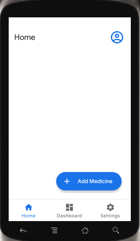
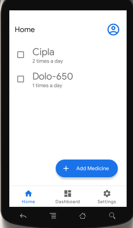
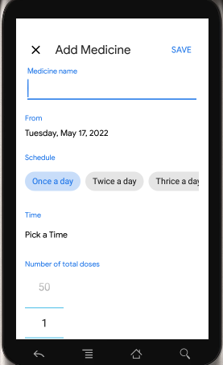
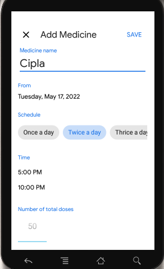
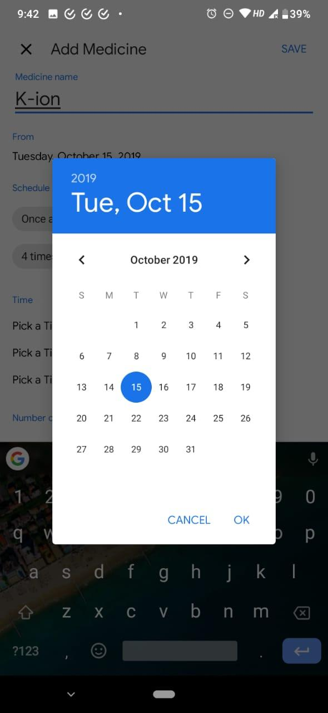
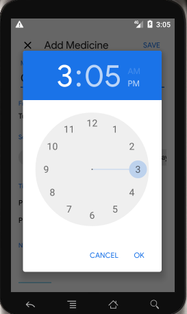
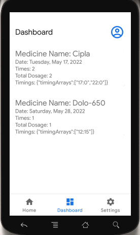
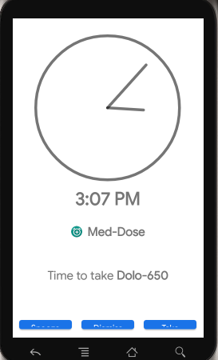

# Med-Dose

A Medicine Reminder App built using native Android in Java.

---
### Tools Used :

#### Backend :
  * Android Studio IDE
  * Java 
  
#### Frontend :
  * XML

---
## Screenshots

---
## To see Full Project Report Please open Below Link :
<b> <a href="Med-Dose_Project_Report.pdf">MedDose-Medicine reminder app</a> </b>

